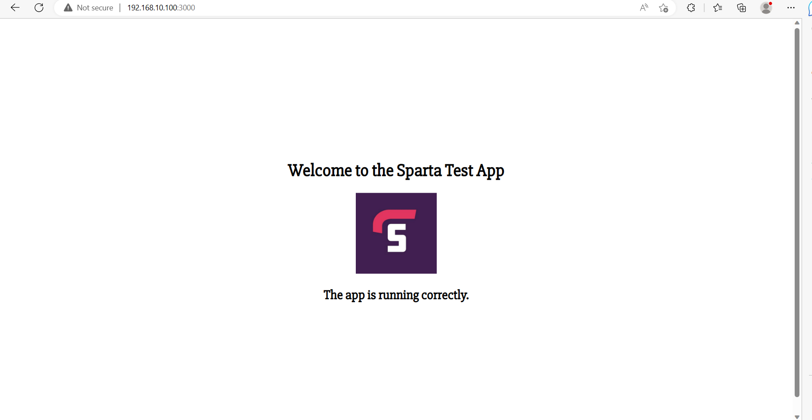

# Deploying an app

First make sure to be in the right directory.

Then:
`vagrant up`
to prepare the VM.

Enter:
`vagrant provision`
if it asks you to do this.

And:
`vagrant ssh`
to enter the VM.

The terminal should look like this:

----

Next:
`sudo apt-get install python-software-properties`

Enter `Y` when asked to.

Then:
`curl -sL https://deb.nodesource.com/setup_6.x | sudo -E bash -`

The result should be:

And finally:
`sudo apt-get install -y nodejs`

----

`cd app`
to go into the app folder.

Then:
`sudo npm install pm2 -g`

Should look like this:

You can ignore the warnings.

Then:
`npm install`

`node app.js` or `npm start`

If you get this:

Then it has been successful.

Go to the web browser and type in:

`192.168.10.100:3000`

and you should see:

If you want to automate the whole process, add the following lines to provision.sh...

Make sure to cd into the correct directory by:

`cd app`

then:

`sudo apt-get install python-software-properties`

`curl -sL https://deb.nodesource.com/setup_6.x | sudo -E bash -`

`sudo apt-get install nodejs -y`

`sudo npm install pm2 -g`

`npm install`

`node app.js` or `npm start`

Your provision.sh file should look like:

cd into the right directory in your terminal and:

`vagrant up`

Your terminal should say:

Go to the web browser and type in:

`192.168.10.100:3000`

It should look like:

